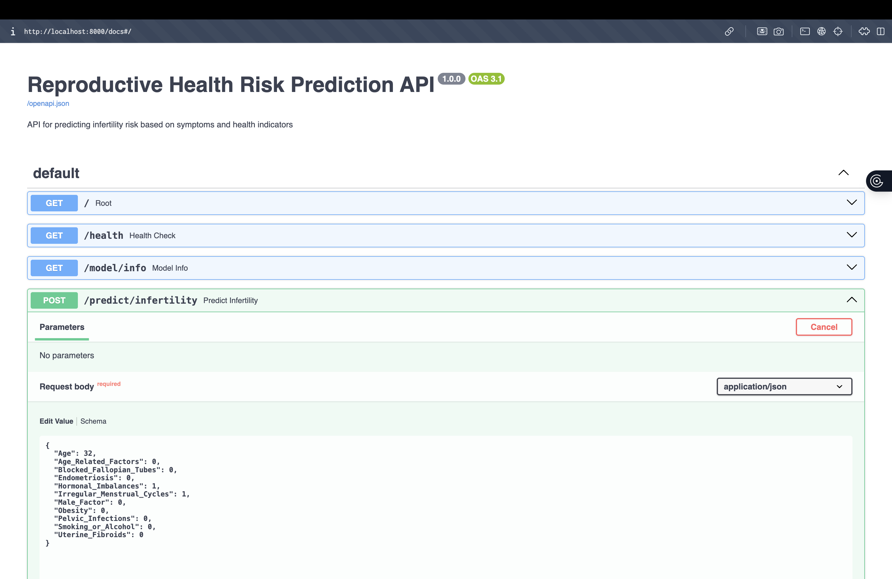

# Design Diagrams and Architecture

This folder contains visual documentation for the Multi-Stage Reproductive Health Risk Prediction System.

## Existing Diagrams

### 1. Class Diagram (`class-diagram.png`)

Shows the object-oriented structure of the system, including classes, their attributes, methods, and relationships.

### 2. Entity Relationship Diagram (`erd-diagram.png`)

Illustrates the database schema and data model relationships for future data storage implementations.

### 3. System Architecture (`system-architecture.png`)

Displays the high-level architecture of the system, showing how components interact.

## API Screenshots

### Recommended Screenshots




## System Architecture Overview

```
┌─────────────────────────────────────────────────────────────┐
│                    Client Applications                       │
│  (Web Browser, Mobile App, Healthcare Worker Portal)        │
└────────────────────┬────────────────────────────────────────┘
                     │ HTTP/HTTPS
                     │ REST API
                     ▼
┌─────────────────────────────────────────────────────────────┐
│                    FastAPI Backend                           │
│  ┌──────────────────────────────────────────────────────┐   │
│  │  Endpoints:                                          │   │
│  │  - GET  /                                            │   │
│  │  - GET  /health                                      │   │
│  │  - GET  /model/info                                  │   │
│  │  - POST /predict/infertility                         │   │
│  │  - GET  /docs (Swagger UI)                           │   │
│  └──────────────────────────────────────────────────────┘   │
│                                                              │
│  ┌──────────────────────────────────────────────────────┐   │
│  │  Input Validation (Pydantic)                         │   │
│  │  - Age: 18-100                                       │   │
│  │  - Symptoms: Binary (0/1)                            │   │
│  └──────────────────────────────────────────────────────┘   │
│                                                              │
│  ┌──────────────────────────────────────────────────────┐   │
│  │  Prediction Pipeline                                 │   │
│  │  1. Load input data                                  │   │
│  │  2. Feature scaling (StandardScaler)                 │   │
│  │  3. Model prediction (Random Forest)                 │   │
│  │  4. Risk stratification                              │   │
│  │  5. Feature importance extraction                    │   │
│  └──────────────────────────────────────────────────────┘   │
└────────────────────┬────────────────────────────────────────┘
                     │
                     ▼
┌─────────────────────────────────────────────────────────────┐
│                    ML Models & Artifacts                     │
│  ┌───────────────┬────────────────┬────────────────────┐    │
│  │  Model        │  Scaler        │  Feature Names     │    │
│  │  (.pkl)       │  (.pkl)        │  (.pkl)            │    │
│  │               │                │                    │    │
│  │  Random       │  Standard      │  11 features:      │    │
│  │  Forest       │  Scaler        │  Age + 10          │    │
│  │  Classifier   │                │  symptoms          │    │
│  └───────────────┴────────────────┴────────────────────┘    │
│  ┌──────────────────────────────────────────────────────┐   │
│  │  Metadata (.pkl)                                     │   │
│  │  - Model name, training date                         │   │
│  │  - Performance metrics (accuracy, recall, etc.)      │   │
│  │  - Training info (samples, SMOTE applied)            │   │
│  └──────────────────────────────────────────────────────┘   │
└─────────────────────────────────────────────────────────────┘
                     ▲
                     │
                     │ Training Pipeline
                     │
┌─────────────────────────────────────────────────────────────┐
│              Jupyter Notebook (Training)                     │
│  ┌──────────────────────────────────────────────────────┐   │
│  │  1. Data Loading & Exploration                       │   │
│  │  2. Data Visualization                               │   │
│  │  3. Feature Engineering                              │   │
│  │  4. Train-Test Split (70/30)                         │   │
│  │  5. SMOTE Balancing (82/18 → 50/50)                  │   │
│  │  6. Feature Scaling                                  │   │
│  │  7. Model Training (LR + RF)                         │   │
│  │  8. Model Evaluation                                 │   │
│  │  9. Model Selection (by Recall)                      │   │
│  │  10. Model Persistence                               │   │
│  └──────────────────────────────────────────────────────┘   │
└────────────────────┬────────────────────────────────────────┘
                     │
                     ▼
┌─────────────────────────────────────────────────────────────┐
│                    Dataset                                   │
│  Female Infertility Dataset (705 patients)                  │
│  - 11 features (Age + 10 binary symptoms)                   │
│  - 1 target (Infertile: 0/1)                                │
│  - Class distribution: 82% at-risk, 18% no-risk             │
└─────────────────────────────────────────────────────────────┘
```

## API Request/Response Flow

```
1. Client sends POST request to /predict/infertility
   ↓
2. FastAPI receives request
   ↓
3. Pydantic validates input (age range, binary values)
   ↓
4. Input converted to numpy array
   ↓
5. StandardScaler transforms features
   ↓
6. Random Forest model predicts
   ↓
7. Probability score extracted
   ↓
8. Risk level calculated (High/Moderate/Low)
   ↓
9. Feature importance extracted (top 5)
   ↓
10. Response JSON constructed
   ↓
11. Client receives prediction with metadata
```

## Model Training Flow

```
Female Infertility.csv (705 records)
   ↓
Load & Rename Features (symptom-based naming)
   ↓
Train-Test Split (70/30 stratified)
   ↓
SMOTE Applied (balance 82/18 → 50/50)
   ↓
StandardScaler Fit on Train Set
   ↓
Transform Train & Test Sets
   ↓
Train Models (Logistic Regression + Random Forest)
   ↓
Evaluate Both Models (Accuracy, Precision, Recall, F1, ROC-AUC)
   ↓
Select Best Model (by Recall - healthcare priority)
   ↓
Save Artifacts:
   - infertility_model.pkl (Random Forest)
   - scaler.pkl (StandardScaler)
   - feature_names.pkl (11 feature names)
   - model_metadata.pkl (performance metrics & info)
```

## Future Architecture Enhancements

1. **Database Layer**:
   - PostgreSQL/MongoDB for prediction history
   - User authentication and session management

2. **Caching Layer**:
   - Redis for frequently accessed model metadata
   - Response caching for common prediction patterns

3. **Message Queue**:
   - RabbitMQ/Celery for asynchronous prediction jobs
   - Batch prediction processing

4. **Monitoring**:
   - Prometheus for metrics collection
   - Grafana for visualization
   - Model performance monitoring

5. **Frontend Application**:
   - React/Vue.js web application
   - Mobile apps (React Native/Flutter)
   - Dashboard for healthcare workers

6. **Multi-Stage Integration**:
   - Stage 2: Pregnancy complications prediction
   - Stage 3: Maternal health prediction
   - Unified prediction pipeline

## Additional Resources

- **API Documentation**: See `../API_DOCUMENTATION.md`
- **Main README**: See `../../README.md`
- **Jupyter Notebook**: See `../../notebooks/infertility_risk_prediction.ipynb`
- **Backend Code**: See `../../backend/main.py`